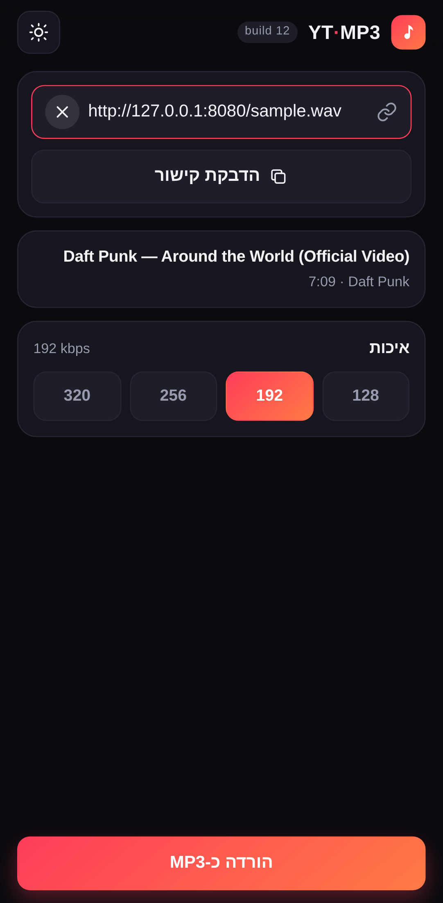
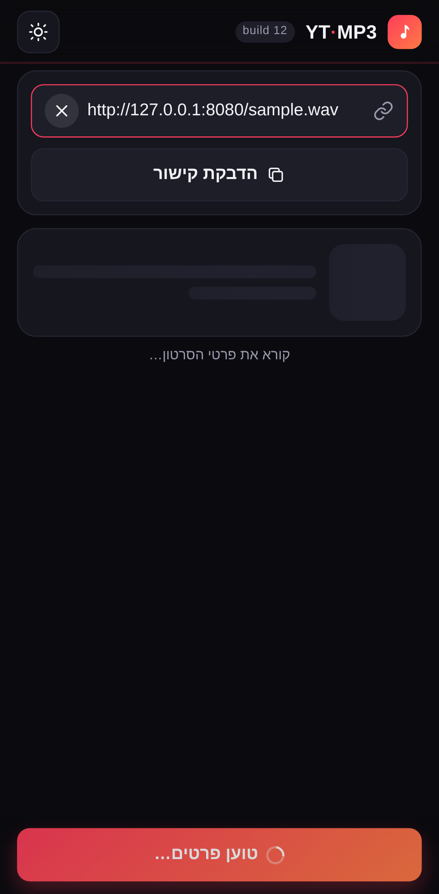

# YT‑MP3

אפליקציית **PWA** להורדת אודיו מיוטיוב כ‑MP3: ממשק סטטי, מותאם מובייל, עם שדה קישור **ושיתוף ישיר מיוטיוב** לאפליקציה.
ההמרה עצמה מתבצעת ע"י שרת קטן שעוטף את **yt‑dlp** — דפדפן לבדו לא יכול להוריד ולקודד אודיו מיוטיוב.

**באוויר:** https://yt-mp3-57bee.web.app

<p align="center">
  
  
</p>

```
web/        ← ה-PWA (Firebase Hosting / GitHub Pages)
functions/  ← bridge.py, המימוש היחיד + עטיפת Cloud Function
server/     ← להרצה כשרת רגיל, מריץ בדיוק את אותו bridge.py
Dockerfile  ← אותו דבר בקונטיינר (בונים מתיקיית השורש)
```

## מה יש באפליקציה

- שדה קישור עם **הדבקה בלחיצה** וזיהוי אוטומטי של הכתובת מתוך טקסט משותף
- **שיתוף מיוטיוב לאפליקציה** (Web Share Target) — הקישור נקלט וההורדה מתחילה לבד
- תצוגה מקדימה: תמונה ממוזערת, שם, ערוץ ואורך
- בחירת איכות: 128 / 192 / 256 / 320 kbps (נשמרת למכשיר)
- שני מצבי עבודה, לפי מה שהשרת מדווח ב‑`/api/health`:
  - `jobs` — התקדמות חיה ב‑SSE (שרת שאתם מריצים)
  - `sync` — בקשה אחת שמחזירה את הקובץ, עם התקדמות אמיתית של ההעברה (סביבות serverless)
- היסטוריה מקומית של 12 ההורדות האחרונות
- עובד אופליין כשלד אפליקציה, מותקן למסך הבית, כהה/בהיר ו‑RTL
- תגיות ID3 ותמונת אלבום מוטמעות בקובץ

## פריסה ל‑Firebase

הפרויקט `yt-mp3-57bee` פרוס ועובד: ה‑PWA ב‑Hosting, ושרת ההמרה כ‑Cloud Function דור 2
(`api`, us‑central1, python312, 1GB, 540 שניות).

```bash
npx firebase deploy                     # הכל
npx firebase deploy --only hosting      # רק הממשק
npx firebase deploy --only functions    # רק שרת ההמרה
```

`firebase.json` מנתב `/api/**` לפונקציה, כך שהאפליקציה מוצאת את השרת לבד — אין מה להגדיר בממשק.
בנוסף `functions/.env` מחזיק את `PUBLIC_API_URL` (כתובת ה‑Run של הפונקציה), ואליה פונות בקשות
ההמרה הארוכות ישירות, כדי לא להיתקל בתקרת הזמן של Hosting לבקשות דינמיות. אם הכתובת הישירה
לא נגישה, האפליקציה חוזרת אוטומטית לניתוב דרך אותו domain.

לפני `deploy --only functions` בפעם הראשונה במחשב חדש:

```bash
cd functions && python3.12 -m venv venv && ./venv/bin/pip install -r requirements.txt
```

## הרצה מקומית

```bash
cd server && ./run.sh          # http://localhost:8000
```

או בקונטיינר, מתיקיית השורש:

```bash
docker build -t ytmp3 .
docker run --rm -p 8000:8000 ytmp3
```

ffmpeg: אם יש אחד במערכת הוא ייבחר; אחרת נעשה שימוש בבינארי הסטטי שמגיע עם `imageio-ffmpeg`.
ההמרה קוראת ל‑ffmpeg ישירות (ולא דרך ה‑postprocessor של yt‑dlp), כדי לא לדרוש `ffprobe` שלא קיים בכל סביבה.

## חיבור הנייד לשרת שאתם מריצים

דף HTTPS לא יכול לפנות לשרת `http://` בכתובת רשת מקומית — הדפדפן חוסם תוכן מעורב:

| דרך | מתאים ל |
|---|---|
| `http://localhost:8000` | דפדפן על אותו מחשב (מותר כחריג) |
| `cloudflared tunnel --url http://localhost:8000` או `ngrok http 8000` | נייד, בלי לפרוס כלום |
| Cloud Run / Fly / Render / Hugging Face Spaces | שימוש קבוע |

מזינים את הכתובת ב‑⚙︎ **הגדרות** ולוחצים **בדיקת חיבור**.

## פריסה ל‑GitHub Pages (אופציונלי)

ב‑**Settings → Pages** בוחרים `Source: GitHub Actions`. כל דחיפה ל‑`main` שנוגעת ב‑`web/` מפרסמת מחדש.

## משתני סביבה

| משתנה | ברירת מחדל | תפקיד |
|---|---|---|
| `PORT` | `8000` | פורט האזנה |
| `ALLOWED_ORIGINS` | `*` | origins מורשים ל‑CORS |
| `SYNC_ONLY` | כבוי | מכריח מצב בקשה־אחת (מה שהפונקציה עושה) |
| `PUBLIC_API_URL` | — | כתובת ישירה שהאפליקציה תעדיף לבקשות ההמרה |
| `JOB_TTL_SECONDS` | `1800` | כמה זמן קובץ נשמר לפני מחיקה |
| `MAX_DURATION_SECONDS` | `0` | חסימת סרטונים ארוכים (0 = ללא הגבלה) |
| `YTDLP_COOKIES_FILE` | — | קובץ cookies, אם יוטיוב מבקש אימות |
| `YTDLP_PROXY` | — | פרוקסי ל‑yt‑dlp |

> בענן יוטיוב לפעמים חוסם IP של דאטה‑סנטרים ומבקש אימות. אם זה קורה, מייצאים cookies מהדפדפן
> ומצביעים עליהם עם `YTDLP_COOKIES_FILE`.

## שיתוף מיוטיוב לאפליקציה

מתקינים את ה‑PWA למסך הבית (Chrome → *הוספה למסך הבית*), ואז ביוטיוב **שיתוף → YT‑MP3**.
מבוסס Web Share Target, שנתמך ב‑Android. ב‑iOS אין תמיכה בתקן, ושם מדביקים את הקישור.

## הערה

הכלי מיועד לתוכן שמותר לכם להוריד — יצירות שלכם, רישיון מתאים או תוכן חופשי,
בהתאם לתנאי השימוש של יוטיוב ולדיני זכויות יוצרים.
